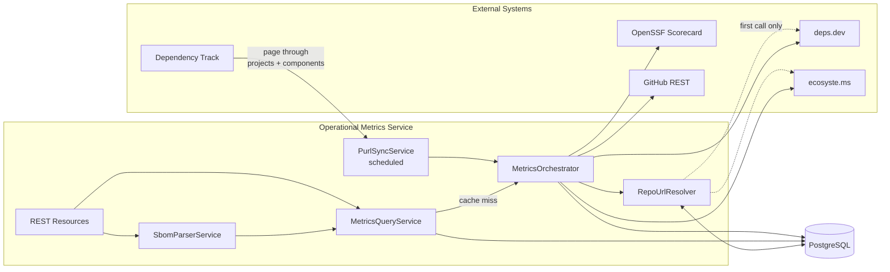
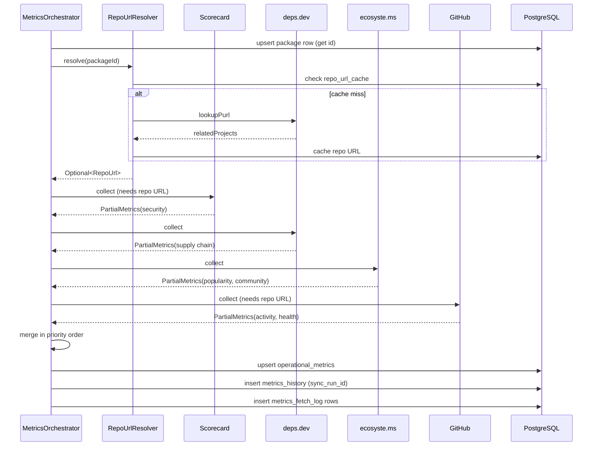
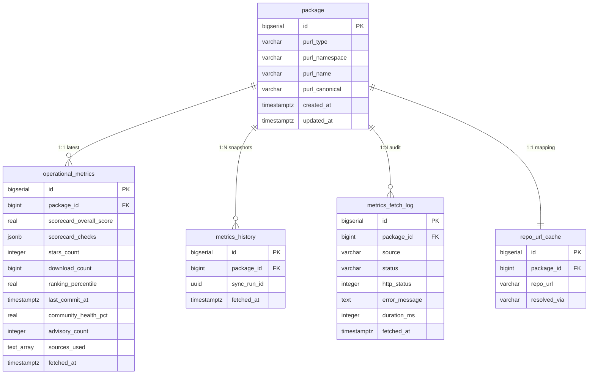
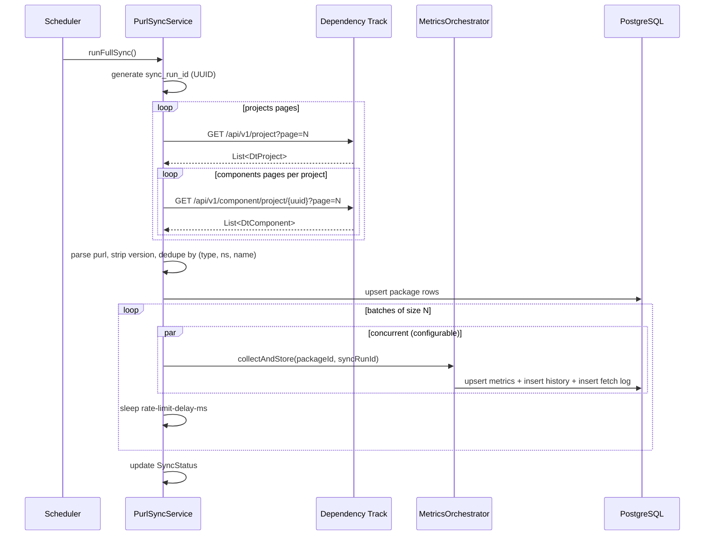
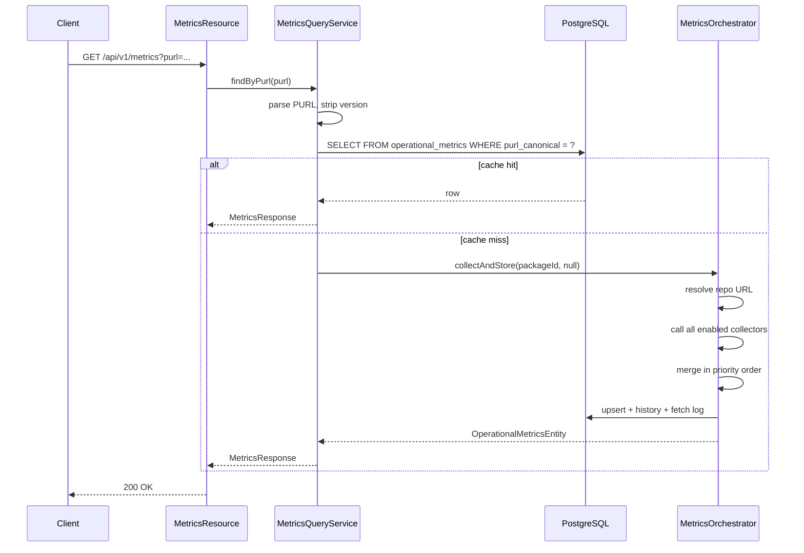
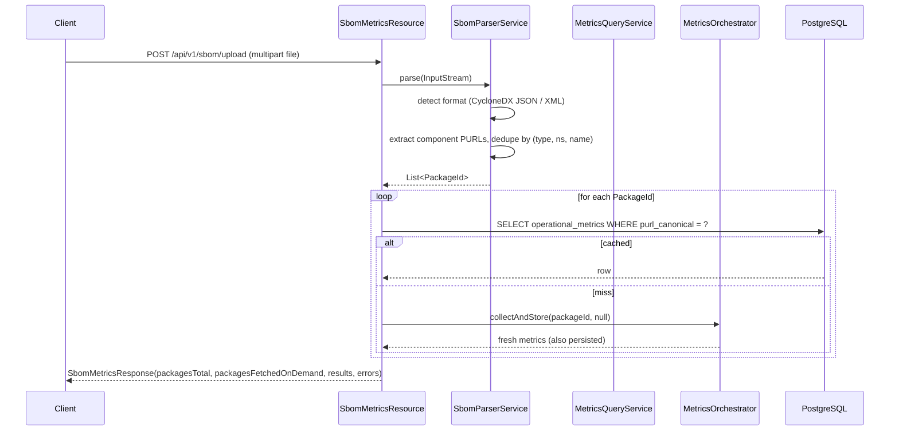

# Architecture

This document describes the internal design of the Operational Metrics service: how components fit together, how data flows in from upstream sources, how it is merged, persisted, and queried.

For the user-facing API and quick start, see [README.md](README.md).

---

## 1. High-level view



Two trigger paths exist:

1. **Scheduled** — `MetricsSyncScheduler` fires `PurlSyncService.runFullSync()`, which pulls every PURL from Dependency Track and feeds them through `MetricsOrchestrator`.
2. **On-demand** — any API call (single, bulk, or SBOM upload) checks the cache; on a miss, `MetricsQueryService` calls `MetricsOrchestrator.collectAndStore()` synchronously and returns the freshly collected result.

Both paths converge in the orchestrator, so the merge logic, persistence, and history snapshotting are all defined in exactly one place.

---

## 2. Component breakdown

| Layer | Class | Responsibility |
|---|---|---|
| `config/` | `SourceConfig`, `DependencyTrackConfig`, `GitHubConfig`, `SyncConfig`, `HistoryConfig`, `ApiConfig` | Quarkus `@ConfigMapping` interfaces — single source of truth for tunables |
| `client/` | `*Client` interfaces | `@RegisterRestClient` definitions for each upstream API + their response DTOs |
| `service/collector/` | `ScorecardCollector`, `DepsDevCollector`, `EcosystemsCollector`, `GitHubCollector` | Implement `MetricsCollector`, translate per-source responses into `PartialMetrics` |
| `service/` | `MetricsOrchestrator` | The merge engine. Calls each enabled collector in priority order, merges results, persists, logs |
| `service/` | `RepoUrlResolver` | PURL → repo URL mapping with DB cache, used by collectors that need a repo URL (Scorecard, GitHub) |
| `service/` | `PurlSyncService` | Pulls PURLs from Dependency Track, drives batched orchestrator calls |
| `service/` | `MetricsQueryService` | API-facing query logic; handles cache lookup and on-demand fetch |
| `service/` | `SbomParserService` | Parses CycloneDX SBOMs and extracts PURLs |
| `service/` | `HistoryPurgeService` | Deletes old history rows past the retention window |
| `repository/` | JDBI `*Dao` interfaces | SqlObject DAOs with explicit upsert SQL and JSONB casts |
| `resource/` | `MetricsResource`, `SyncResource`, `SbomMetricsResource` | JAX-RS endpoints |
| `scheduler/` | `MetricsSyncScheduler`, `HistoryPurgeScheduler` | `@Scheduled` cron triggers |

All components use **constructor injection**. There are no `@Inject` fields in the codebase.

---

## 3. Data sources and capability matrix

Each upstream source provides a different cross-section of the metrics surface. The orchestrator does not assume any one source is complete; instead, it merges contributions from all enabled sources.

| Field | Scorecard | deps.dev | ecosyste.ms | GitHub |
|---|:---:|:---:|:---:|:---:|
| `scorecard_overall_score` | **★** | ✓ | ✓ | — |
| `scorecard_checks` | **★** | ✓ | ✓ | — |
| `stars_count` / `forks_count` | — | ✓ | ✓ | **★** |
| `dependent_repos_count` | — | ✓ | **★** | — |
| `dependent_packages_count` | — | ✓ | **★** | — |
| `download_count` / `ranking_percentile` | — | — | **★** | — |
| `commit_frequency_52w` | — | — | ✓ | **★** |
| `contributor_count` | — | — | ✓ | **★** |
| `community_health_pct` | — | — | — | **★** |
| `avg_issue_close_time_days` / `avg_pr_close_time_days` | — | — | **★** | — |
| `advisory_count` | — | ✓ | ✓ | **★** |
| `has_slsa_provenance` | — | **★** | — | — |
| `has_oss_fuzz` | — | **★** | — | — |
| `last_commit_at` / `is_archived` | — | — | ✓ | **★** |
| `maintainer_count` | — | — | **★** | — |
| **repo URL resolution** | — | **★** | ✓ | — |

★ = primary / authoritative source for that field. ✓ = also provides it.

The default priority order — Scorecard → deps.dev → ecosyste.ms → GitHub — reflects this: each source's strongest column lines up with where it sits in the chain.

---

## 4. The merge strategy

The orchestrator never overwrites a non-null field. For each enabled source in priority order it calls `collector.collect(...)`, gets back a `PartialMetrics` with only the fields that source could fill, and merges it into the running result with this rule:

```java
// PartialMetrics.mergeFrom(other)
if (this.starsCount == null)            this.starsCount = other.starsCount;
if (this.scorecardOverallScore == null) this.scorecardOverallScore = other.scorecardOverallScore;
// ... same pattern for every field
```

Higher-priority sources always win. Failures from one source (HTTP errors, timeouts, missing repo URL) are logged to `metrics_fetch_log` and do not block other sources from running. The final `sources_used` array on the persisted row records which collectors returned at least one field.



---

## 5. PURL → repo URL resolution

Two of the four sources (Scorecard, GitHub) need an `owner/repo` pair, not a PURL. The other two (deps.dev, ecosyste.ms) accept a PURL directly **and** can also tell us the repo URL. `RepoUrlResolver` exploits that:

1. Look up `repo_url_cache` by `package_id` — done if hit.
2. Call `deps.dev` `/v3alpha/purl/{purl}` and pull the first `relatedProjects[].projectKey.id` matching `github.com/...`.
3. If empty, call `ecosyste.ms` `/api/v1/packages/lookup?purl=...` and use `repository_url`.
4. Persist the result so subsequent runs (and other API calls) skip the lookup.

If both fail, Scorecard and GitHub are skipped for that package and the failure is logged. The remaining sources (deps.dev and ecosyste.ms) still run since they don't need the repo URL.

---

## 6. Database schema

Five tables, all under Liquibase changeset control in `src/main/resources/db/changelog/`.



### Key design choices

- **Version is not part of the package identity.** The unique key on `package` is `(purl_type, purl_namespace, purl_name)`. Operational metrics describe a project, not a version of it.
- **One latest row per package** — `operational_metrics` has `UNIQUE(package_id)`. Each sync upserts. This makes API queries trivial.
- **Append-only history** — `metrics_history` shares the same column shape as `operational_metrics` but adds `sync_run_id` for grouping snapshots produced by the same sync, and has no uniqueness constraint. The retention purge job trims it to `metrics.history.retention-days`.
- **Audit log is separate** — `metrics_fetch_log` records *every* upstream call (success, failure, skip, rate-limit) with timing and HTTP status, so source health and quirks can be queried without touching the metrics tables.
- **JSONB for irregular fields** — `scorecard_checks` (variable-length array of check results) and `commit_frequency_52w` (52-element int array) are stored as JSONB. The ORM-free JDBI layer casts them explicitly: `CAST(:scorecardChecks AS JSONB)`.
- **`sources_used` is a `TEXT[]`** — Postgres array, queryable with `ANY(...)`.

---

## 7. Sync flow (Dependency Track → DB)



Sync is single-instance: the service uses an `AtomicReference<SyncStatus>` to short-circuit overlapping triggers. Concurrency, batch size, and inter-batch delay are all in `metrics.sync.*` config.

---

## 8. API request flow (cache + on-demand fetch)



For the bulk endpoint, `MetricsQueryService` fans out the missing PURLs to a fixed-size thread pool (`metrics.api.on-demand-concurrency`) and waits for all to complete before returning.

---

## 9. SBOM upload flow



CycloneDX format is auto-detected by the `BomParserFactory`. Components without a PURL (e.g., file-only entries) are skipped silently. Per-package failures are collected into the response's `errors[]` rather than aborting the entire upload.

---

## 10. Operational concerns

### Rate limiting

| Source | Limit | Strategy |
|---|---|---|
| OpenSSF Scorecard | No published limit, CDN-cached | Trust the CDN; back off on 5xx |
| deps.dev | Not documented | `metrics.sync.rate-limit-delay-ms` between batches |
| ecosyste.ms | 5K/hr → 15K/hr with email in `User-Agent` | `ECOSYSTEMS_CONTACT_EMAIL` is wired into the client header |
| GitHub | 5K/hr authenticated | `GITHUB_TOKEN` required; collector logs and degrades gracefully on failure |

### Failure isolation

A failure in any one collector is contained: the orchestrator catches the exception, logs a `FAILED` entry to `metrics_fetch_log` with the HTTP status if available, and proceeds with the remaining sources. The persisted row reflects whatever data was successfully gathered.

### Concurrency model

- **Per-API-request:** synchronous (the calling thread executes everything).
- **Bulk API:** fixed thread pool sized to `metrics.api.on-demand-concurrency`.
- **Scheduled sync:** fixed thread pool sized to `metrics.sync.concurrency`, processing batches of `metrics.sync.batch-size` at a time, with a `metrics.sync.rate-limit-delay-ms` sleep between batches.
- **Sync trigger guard:** `AtomicReference<SyncStatus>` prevents overlapping syncs.

### Why JDBI, not Hibernate

Two reasons: explicit control of upserts (`INSERT ... ON CONFLICT DO UPDATE`) with thirty-plus columns, and JSONB column handling without ORM friction. The DAOs are thin SqlObject interfaces — no service-layer plumbing, no managed-entity lifecycle.

### Observability hooks

- `metrics_fetch_log` is the source-of-truth for diagnosing upstream issues.
- `sync_run_id` on each `metrics_history` row groups snapshots from the same scheduled run, making it easy to compare across sync cycles.
- Quarkus SmallRye Health is enabled, exposing `/q/health/live`, `/q/health/ready`, `/q/health/started`.

---

## 11. Things that are intentionally simple

- **No retry layer.** A failed upstream call goes into `metrics_fetch_log` with `FAILED`. The next sync (or next on-demand fetch) will try again. We don't queue retries because the data being retrieved is rarely time-critical and adds complexity.
- **No materialised aggregations.** Rankings / trends are a query-time concern; we keep the source data and let consumers slice it.
- **No write-through cache.** The DB *is* the cache. Any layer in front of it would risk staleness without solving a real load problem.
- **One latest snapshot per package.** Per-version metrics are out of scope by design — operational health is a property of a project, not a release.
